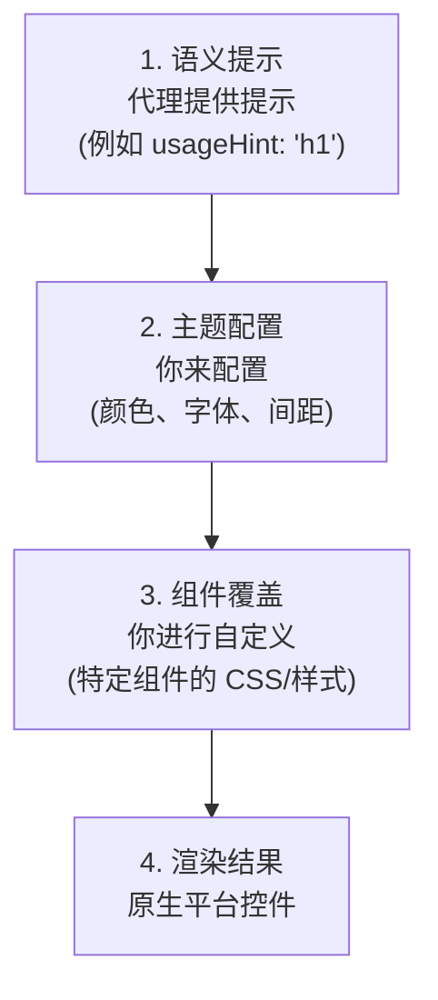

# 主题与样式

自定义 A2UI 组件的外观与风格，让它们匹配你的品牌。

## A2UI 的样式理念

A2UI 采用 **由客户端控制样式** 的方式：

- **代理描述要显示什么**（组件与结构）
- **客户端决定它看起来如何**（颜色、字体、间距）

这样可以保证：

- ✅ **品牌一致性**：所有 UI 都会匹配你的应用设计系统
- ✅ **安全性**：代理不能注入任意 CSS 或样式
- ✅ **可访问性**：你可以掌控对比度、焦点状态和 ARIA 属性
- ✅ **平台原生感**：Web 应用看起来像 Web，移动端看起来像移动端

## 样式层次

A2UI 的样式按层次工作：



## 第 1 层：语义提示

代理提供的是语义提示，而不是视觉样式，用来指导客户端渲染：

```json
{
  "id": "title",
  "component": {
    "Text": {
      "text": {"literalString": "Welcome"},
      "usageHint": "h1"
    }
  }
}
```

**常见的 `usageHint` 值：**

- Text：`h1`、`h2`、`h3`、`h4`、`h5`、`body`、`caption`
- 其他组件也有各自的提示值（参见 [组件参考](../reference/components.md)）

客户端渲染器会根据你的主题和设计系统，把这些语义提示映射为真正的视觉样式。

## 第 2 层：主题配置

每个渲染器都提供一种方式来全局配置你的设计系统，包括：

- **颜色**：主色、辅助色、背景、表面、错误、成功等
- **排版**：字体族、字号、字重、行高
- **间距**：基础单位和尺度（xs、sm、md、lg、xl）
- **形状**：圆角值
- **层级**：用于表现深度的阴影样式

TODO：补充各平台的主题指南：

**Web（Lit）：**

- 如何通过渲染器初始化配置主题
- 可用的主题属性

**Angular：**

- 与 Angular Material 主题系统的集成
- 独立的 A2UI 主题配置

**Flutter：**

- A2UI 如何使用 Flutter 的 `ThemeData`
- 自定义主题属性

**查看可运行示例：**

- [Lit samples](https://github.com/google/a2ui/tree/main/samples/client/lit)
- [Angular samples](https://github.com/google/a2ui/tree/main/samples/client/angular)
- [Flutter GenUI docs](https://docs.flutter.dev/ai/genui)

## 第 3 层：组件覆盖

除了全局主题之外，你还可以覆盖特定组件的样式：

**Web 渲染器：**

- 使用 CSS 自定义属性（CSS variables）进行更细粒度的控制
- 使用标准 CSS 选择器对特定组件进行覆盖

**Flutter：**

- 通过 `ThemeData` 为特定 widget 覆盖主题

TODO：为各平台补充详细的组件覆盖示例。

## 常见样式能力

### 深色模式

A2UI 渲染器通常会根据系统偏好自动支持深色模式：

- 自动检测系统主题（`prefers-color-scheme`）
- 手动选择亮色/深色主题
- 自定义深色主题配置

TODO：补充深色模式配置示例。

### 响应式设计

A2UI 组件默认就是响应式的。你还可以进一步定制响应式行为：

- 针对不同屏幕尺寸使用媒体查询
- 使用容器查询实现组件级响应式
- 响应式的间距与排版尺度

TODO：补充响应式设计示例。

### 自定义字体

在你的 A2UI 应用中加载并使用自定义字体：

- Web 字体（Google Fonts 等）
- 自托管字体
- 平台特定的字体加载

TODO：补充自定义字体示例。

## 最佳实践

### 1. 使用语义提示，不要使用视觉属性

代理应该提供语义提示（`usageHint`），而不是视觉样式：

```json
// ✅ 好的做法：语义提示
{
  "component": {
    "Text": {
      "text": {"literalString": "Welcome"},
      "usageHint": "h1"
    }
  }
}

// ❌ 不好的做法：视觉属性（不支持）
{
  "component": {
    "Text": {
      "text": {"literalString": "Welcome"},
      "fontSize": 24,
      "color": "#FF0000"
    }
  }
}
```

### 2. 保持可访问性

- 确保足够的颜色对比度（WCAG AA：普通文本 4.5:1，大号文本 3:1）
- 使用屏幕阅读器测试
- 支持键盘导航
- 在亮色和深色模式下都进行测试

### 3. 使用设计令牌

定义可复用的设计令牌（颜色、间距等），并在样式中统一引用，以保持一致性。

### 4. 跨平台测试

- 在所有目标平台上测试主题效果（Web、移动端、桌面端）
- 验证亮色和深色模式
- 检查不同屏幕尺寸和屏幕方向
- 确保跨平台的品牌体验一致

## 下一步

- **[自定义组件](custom-components.md)**：用你的样式构建自定义组件
- **[组件参考](../reference/components.md)**：查看所有组件的样式选项
- **[客户端接入](client-setup.md)**：在应用中设置渲染器
