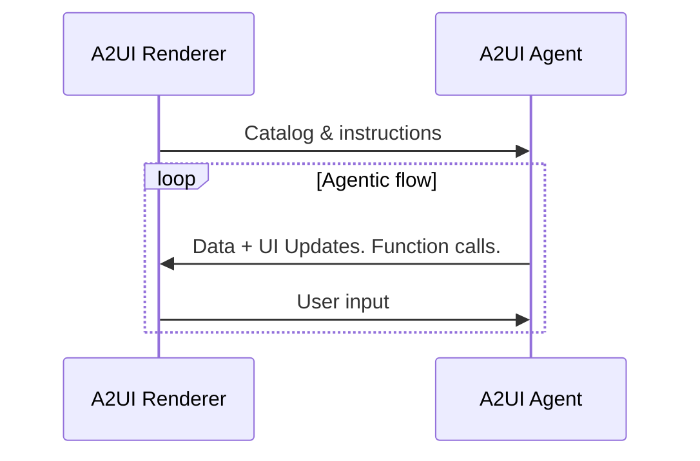
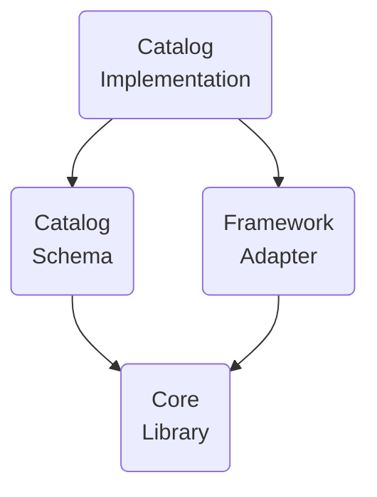

# 术语表

## A2UI 协议术语

A2UI 协议要求使用的术语。

### A2UI agent 与 A2UI renderer

A2UI 协议支持 **agent** 与 **renderer** 之间的对话：

1. **Renderer** 以 A2UI catalog 的形式提供 **UI 能力**，并提供如何使用这些能力的 **instructions**。
2. **Agent** 在循环中迭代：
    - 在考虑收到的 catalog 后，提供要调用的 **UI** 和 **functions**
    - 接收由 renderer 传达的 **用户输入**
    - 更新要显示在 UI 中的 **数据**

虽然协议面向 **AI 增强型 agent** 设计，但它也可以与确定性的 agent 一起工作。例如，agent 可以返回预先准备好的 A2UI UI。

如果 agent 是无状态的，或不保证保留 catalog，renderer 应在每条消息中都提供 catalog。

有时 agent 会使用预定义 catalog，这会要求 renderer 要么支持该 catalog，要么使用适配器。

### GenUI Component

允许 agent 使用的 UI 组件。例如：日期选择器、轮播、按钮、酒店选择器。

### Catalog

1. 逐项列出的 renderer 能力：
    - agent 可用于生成 UI 的组件列表
    - renderer 可调用的函数列表
    - 样式和主题
2. 关于这些 renderer 能力应如何使用的说明。

可以观察到，不同使用场景下，catalog 组件可能与领域关联得更弱或更强：

- **更通用**：

    按钮、标签、行、列、选项选择器等基础 UI 原语。

- **更领域化**：

    类似 HotelCheckout 或 FlightSelector 的组件。

### Basic Catalog

由 A2UI 团队维护的 catalog，用于快速开始使用 A2UI。

参见 [basic catalog](../specification/v1_0/catalogs/basic/catalog.json)。

### Surface

由 A2UI agent 构造、由 A2UI renderer 管理的一块 UI 区域，由多个组件组成。Surface 不能嵌套。

### Agent 架构

A2UI agent 有多种选项：

- **同进程或服务端**：

    Agent 与 renderer 可以位于客户端应用的同一进程中。例如：桌面 Flutter 应用。

    或者，renderer 可以位于显示 UI 的机器上，而 agent 位于另一台机器（服务器）上。

- **Orchestrator agent**：

    中央 orchestrator 管理用户与多个专门 sub-agent 之间的交互。Orchestrator 可以在同一进程中，也可以在服务器上。

- **拉取 / 推送**：

    Agent 可以等待来自 renderer 的消息/请求，也可以主动向 renderer 推送消息/请求。

- **有状态 / 无状态**：

    Agent 可以保留状态，也可以是无状态的。

- **与其他协议混合使用**：

    A2UI 可以与其他协议组合使用。例如，agent 可以是 MCP 和/或 A2A server。

- **其他变体**：

    除上述选项外，也可以采用任意自定义变体。

### Renderer 栈

A2UI renderer 的功能由可独立开发并复用的层组成：

- **Core Library**：

    描述 catalog 以及与 agent 交互所需的一组原语。

    例如，参见 [JavaScript web core library](../../../renderers/web_core/README.md)。

- **Catalog Schema**：

    以 JSON 形式定义 catalog。

    例如，参见 [basic catalog schema](../specification/v1_0/catalogs/basic/catalog.json)。

- **Framework adapter**：

    在具体框架中实现 agent 指令执行的代码。例如：
    - JavaScript core 与 catalog 可以适配 Angular、Electron、React 和 Lit 框架。
    - Dart core 与 catalog 可以适配 Flutter 和 Jaspr 框架。

    参见 [Angular adapter](../../../renderers/angular/README.md)。

- **Catalog Implementation**：

    某个框架对 catalog schema 的实现。

    例如：
    - 参见 [Angular 对 basic catalog 的实现](../../../renderers/angular/src/v0_9/catalog/basic)

### A2UI message

Agent 与 renderer 之间的消息。

由于协议允许流式传输，任何消息都可以是已结束（完全交付）或未结束（部分交付）。已结束的消息可以是已完成（成功交付），也可以是被中断（因技术问题停止交付）。

参见 [数据流指南](data-flow.md)。

### Agent turn

Agent 在开始等待用户输入之前发送的一组消息。

### Data model

Renderer 与 agent 共享、双方都可更新的可观察、层级式、类 JSON 对象。每个 Surface 都有单独的 Data Model。

组件可以绑定到 data model 的节点上，以便在值发生变化时自动更新。

Data model 通过把用户交互捕获到状态对象中并传给 agent，同时允许 agent 将数据更新推回 UI，从而实现双向同步。

参见 [数据绑定指南](data-binding.md)。

### Data reference

在组件定义中，对某个数据元素的引用；该引用可以通过 data model 中的路径解析，也可以按值解析。

参见 [basic catalog 中的示例](../specification/v1_0/catalogs/basic/catalog.json#L18)。

### Client function

供 agent 在需要时调用的函数。

不要与 LLM tool 混淆：

| 特性      | Client Function                                                       | LLM Tool Invocation                                                                   |
| --------- | --------------------------------------------------------------------- | ------------------------------------------------------------------------------------- |
| 执行者    | A2UI Renderer                                                         | LLM 请求调用，不关心执行细节。                                                       |
| 时机      | Agent 到 renderer 的消息发送之后。                                    | Agent 到 renderer 的消息发送之前。                                                    |
| 目的      | UI 逻辑（校验、可见性切换、格式化）                                   | 推理、数据获取、后端操作                                                              |
| 定义      | 注册在客户端函数注册表中，并在 catalog 中声明                         | 定义在 ToolDefinition 中（传给 LLM）                                                  |
| 状态访问  | 可访问 DataContext 和输入值。                                         | 不能访问用于触发 AI 的请求。可访问外部 API、数据库和服务                              |

参见 [common types 中的示例](../specification/v0_9/json/common_types.json#L200)。

### Action

由用户在 UI 中触发的交互容器。Action 分为两类：

- **Event**：派发给 agent 处理（例如点击“Submit”）。
- **Function**：在 renderer 本地执行（例如打开 URL）。

参见 [actions 详细指南](actions.md)。

## 生成式 UI 术语

这些术语不是 A2UI 协议必需的，但在生成式 UI 语境中常用。

### GenUI 的已知模式

- **Chat**：

    生成的 UI 片段按时间顺序逐个出现在可垂直滚动的区域中，并与用户输入混合显示。

- **Canvas**：

    与 agent 协作的空间。

- **Dashboard**：

    生成的 UI 片段不是按时间，而是按含义组织，并稳定地（也称 pinned）停留在用户期望看到的位置。

- **Wizard**：

    生成的 UI 片段逐个显示，目标是收集某项任务所需的信息。

### NoAI information

被归类为 **AI 不可访问** 的信息（例如信用卡信息）。

哪些信息不应被 AI 访问由应用所有者定义，并且在 **不同上下文中不同**。例如，在某些上下文中，病史绝不能进入 AI；而在另一些上下文中，AI 会大量用于辅助医疗诊断，因此需要病史。

这个术语在 GenUI 语境中很重要，因为最终用户希望 **清楚看到** 自己输入的哪些内容允许传给 AI，哪些内容不允许。
