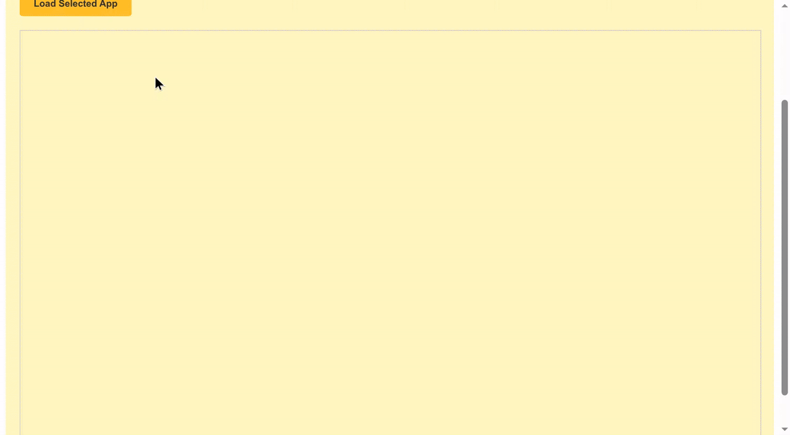
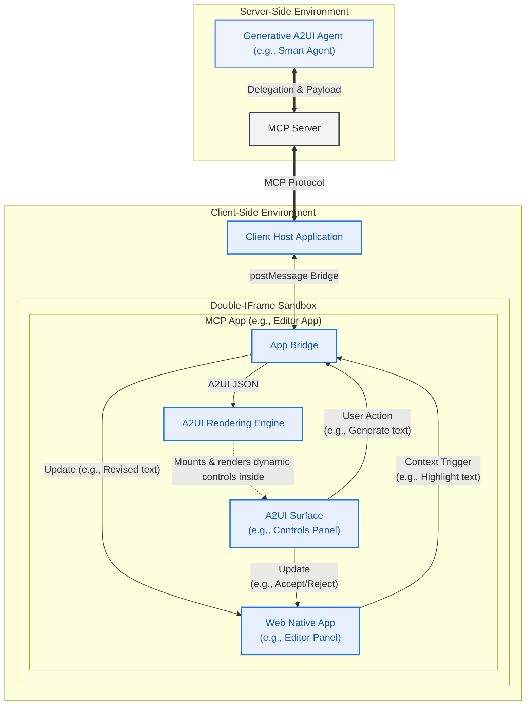
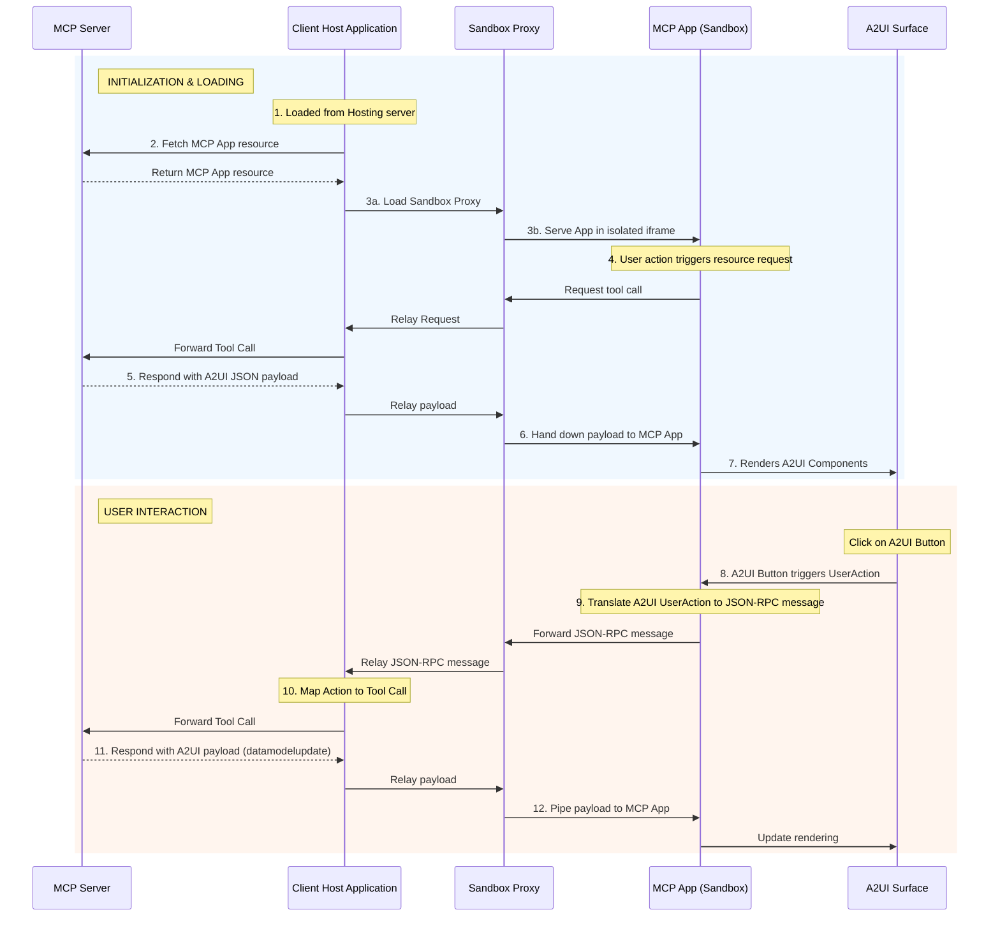

# 在 MCP Applications 中动态渲染 A2UI

本指南展示如何使用 Tools 和 Embedded Resources，在 [MCP Apps](https://modelcontextprotocol.io/extensions/apps/overview) 中提供丰富、交互式的 A2UI 界面。完成后，你将拥有一个可工作的 MCP server，它会返回一个能够渲染 A2UI 组件并处理 A2UI 交互的 MCP App。通过在 MCP Apps 中支持原生 A2UI，你的 MCP server 可以在保持 UI 样式一致性的同时，与远程 agent 安全协作。



## 前置条件

- **[Python 3.10+](https://www.python.org/)**
- **[uv](https://docs.astral.sh/uv/)** — 快速 Python 包管理器
- **[Node.js 18+](https://nodejs.org/)**（用于 MCP Inspector）

## 快速开始：运行示例

关于如何运行此示例的详细说明，请参阅 [README.md](https://github.com/a2ui-project/a2ui/blob/main/samples/community/mcp/a2ui-in-mcpapps/README.md)。

## 架构概览

系统由三个主要参与者组成，它们通过一条通信链路交互：

1.  **客户端宿主应用**：外层容器（例如 Angular app），连接到 MCP Server，并为 MCP App 承载安全 sandbox。
2.  **MCP 应用（沙箱化）**：不可信的第三方 Web 应用（例如 Lit 或 Angular micro-app），运行在双 iframe sandbox 中。该 app 内包含 A2UI surface。
3.  **MCP Server**：提供应用资源并处理 tool call 的后端 server。



## 深入：通信流程

这个模式的关键点是 **MCP App** 会直接渲染 A2UI payload，而不是依赖 Client Host Application 来渲染。

### 在 MCP Apps 中加载 A2UI 组件

下面是将 A2UI 组件动态加载到 MCP Apps 中的事件序列：

1.  **Trigger**：MCP App 决定需要获取或更新 UI 内容（例如初始化时，或通过用户发起的 Action）。
2.  **Request**：MCP App 通过 `window.parent.postMessage` 向 Host 发送 JSON-RPC 请求。
    - _示例 Method_：`ui/fetch_counter_a2ui`
3.  **Relay**：Sandbox Proxy 将该消息转发给 Client Host。
4.  **MCP Call**：Client Host 将这个自定义消息转换为标准 MCP `tools/call` 请求，并发送给 MCP Server。
    - _示例 Tool_：`fetch_counter_a2ui`
5.  **Response**：MCP Server 执行 tool，并返回包含 `application/a2ui+json` resource 的结果。
6.  **响应转发**：Host 收到 tool result，并通过 Sandbox Proxy 向下转发回 MCP App。
7.  **渲染**：MCP App 从 resource 中提取 A2UI JSON payload，并送入本地 A2UI `MessageProcessor`，从而动态更新 A2UI surface。

### 处理用户 Action

渲染出的 A2UI surface 内的交互通过反向流程处理：

1.  用户点击 MCP App 内 A2UI surface 中的按钮。
2.  A2UI 组件触发 `userAction`。
3.  MCP App 通过 A2UI `MessageProcessor.events` 订阅捕获该事件。
4.  MCP App 打包 action，并以 JSON-RPC 消息形式发送给 Host（例如 `ui/increase_counter`）。
5.  Host 调用 MCP Server 上对应的 tool。
6.  Server 返回新的 A2UI payload（表示更新后的状态），该 payload 会被管道式传回 MCP App 以更新渲染。

### 时序图



## 如何实现

要构建具备 A2UI 能力的 MCP App，请按以下步骤操作：

### 第 1 步：内联 Renderer

MCP Apps 通常作为单个 HTML resource 从 MCP Server 交付。要用 Angular 或 React 这样的现代框架实现这一点：

1.  正常构建你的应用，产出静态资源（`index.html`、`.js`、`.css`）。
2.  使用构建后脚本（例如示例中的 [`inline.js`](https://github.com/a2ui-project/a2ui/blob/main/samples/community/mcp/a2ui-in-mcpapps/server/apps/src/inline.js) 脚本）读取 `index.html`，并把外部 `<script src="...">` 与 `<link rel="stylesheet" href="...">` 标签替换为内联 `<script>` 与 `<style>` 标签，内容为实际文件内容。
3.  这样会生成一个自包含 HTML 文件，可以通过受限 iframe 的 `srcdoc` 安全加载。

> [!TIP]
> **使用 Vite 内联**
>
> 如果项目使用 Vite（React、Vue 或 Lit 中常见），可以用 `vite-plugin-singlefile` 等插件自动实现相同的单文件输出。它会在构建过程中处理内联，免去自定义构建后脚本。
>
> **使用方式：**
>
> 1. **安装插件**：
>
>     ```bash
>     npm install -D vite-plugin-singlefile
>     ```
>
> 2. **配置 Vite**：将插件加入 `vite.config.ts`（或 `.js`）：
>
>     ```typescript
>     import {defineConfig} from 'vite';
>     import {viteSingleFile} from 'vite-plugin-singlefile';
>
>     export default defineConfig({
>       plugins: [viteSingleFile()],
>     });
>     ```
>
>     这样会确保构建时所有 JS 和 CSS 资源都内联进 `index.html`，使其可作为单个 resource 由 MCP server 提供。

### 第 2 步：利用 A2UI-over-MCP

内联 app 现在已在 sandbox 中运行。要利用 A2UI：

1.  将 **A2UI Angular/Lit 库** 包含进 app bundle。
2.  与 Host 定义通信契约，以便与 MCP Server 交互。
3.  收到 Host 响应后，在 content 中查找 `application/a2ui+json` mimeType。
4.  解析 JSON 文本，并传给 A2UI [`MessageProcessor`](https://github.com/a2ui-project/a2ui/blob/main/renderers/angular/src/v0_8/data/processor.ts)。

**示例：获取并渲染 A2UI**

```typescript
// 1. Request A2UI data from Host
const result = await callHostMethod('ui/fetch_counter_a2ui');

// 2. Find and parse the A2UI resource
const a2uiResource = result.find(
  c => c.type === 'resource' && (c.resource?.mimeType === 'application/a2ui+json' || c.resource?.mimeType === 'application/json+a2ui'),
);

if (a2uiResource?.resource?.text) {
  const messages = JSON.parse(a2uiResource.resource.text);
  this.processor.processMessages(messages);
}

// Utility for JSON-RPC communication
function callHostMethod(method: string, params: any = {}): Promise<any> {
  return new Promise((resolve, reject) => {
    const requestId = `${method}-${Date.now()}`;

    const handler = (event: MessageEvent) => {
      if (event.data.id !== requestId) return;
      window.removeEventListener('message', handler);

      if (event.data.error) {
        reject(event.data.error);
      } else {
        resolve(event.data.result);
      }
    };

    window.addEventListener('message', handler);

    window.parent.postMessage(
      {
        jsonrpc: '2.0',
        id: requestId,
        method,
        params,
      },
      '*',
    ); // Note: Replace "*" with explicit target origin in production
  });
}
```

### 第 3 步：处理 A2UI 组件上的用户 Action

要处理渲染出的 A2UI surface 内部交互，MCP App 必须捕获 A2UI event，并使用 JSON-RPC 将其转发给 Host。

**示例：处理用户 Action**

```typescript
// Subscribing to A2UI events in the MCP App ([main.ts](https://github.com/a2ui-project/a2ui/blob/main/samples/community/mcp/a2ui-in-mcpapps/server/apps/src/src/main.ts))
this.processor.events.subscribe(async event => {
  if (!event.message.userAction) return;

  const method = `ui/${event.message.userAction.name}`;
  const params = event.message.userAction.context;

  try {
    // Translate A2UI UserAction to JSON-RPC, send to Host, and await response
    const result = await callHostMethod(method, params);

    // Parse the updated A2UI payload and update the rendering
    const messages = extractA2UIMessages(result);
    if (messages) {
      this.processor.processMessages(messages);
    }
  } catch (error) {
    console.error(`Error handling user action[${method}]:`, error);
  }
});
```

这种模式让 MCP App 能作为 MCP Server A2UI 能力的动态界面，同时保持严格的安全隔离。

### 内联 MCP App HTML 伪代码

把这些内容放在一起，下面是一个 HTML mockup，表示已编译并内联的 MCP Application。它使用原生 `<a2ui-surface>` 元素定义占位 UI，初始化 `AppBridge` 与外层 host 通信，在加载时获取动态 A2UI layout，并使用已加载的 A2UI SDK 处理事件：

```html
<!DOCTYPE html>
<html lang="en">
  <head>
    <meta charset="UTF-8" />
    <title>Inlined MCP App Surface</title>
    <!-- Assumes the standard A2UI SDK script is bundled or loaded -->
  </head>
  <body>
    <div>
      <h3>MCP App (Editor Panel)</h3>
      <p>This text is native to the sandboxed third-party app.</p>

      <!-- A2UI Surface custom element provided by the A2UI SDK -->
      <a2ui-surface surfaceId="recipe-card"></a2ui-surface>
    </div>

    <script>
      // Note: The pseudocode below assumes AppBridge from @modelcontextprotocol/ext-apps
      // and a2uiProcessor from the A2UI SDK are preloaded or inlined.
      const bridge = new AppBridge({name: 'editor-panel', version: '1.0.0'});

      // Helper to extract and process dynamic A2UI responses from tool results
      function processA2UIResponse(result) {
        const a2uiResource = result?.content?.find(
          c => c.type === 'resource' && (c.resource?.mimeType === 'application/a2ui+json' || c.resource?.mimeType === 'application/json+a2ui'),
        );
        if (a2uiResource?.resource?.text) {
          const payload = JSON.parse(a2uiResource.resource.text);
          window.a2uiProcessor.processMessages(payload);
        }
      }

      // 1. Initialize AppBridge and fetch initial controls
      async function initApp() {
        await bridge.connect();

        // Call server tool to load initial layout controls
        const result = await bridge.callServerTool({name: 'fetch_controls', arguments: {}});
        processA2UIResponse(result);
      }

      // 2. Handle interactive User Actions routed by the A2UI SDK
      window.a2uiProcessor.events.subscribe(async event => {
        if (!event.message.userAction) return;
        const action = event.message.userAction;

        // Route the user action directly via the bridge to the MCP Server tool
        const result = await bridge.callServerTool({
          name: action.name,
          arguments: action.context,
        });

        // Feed any updated server UI states back to the A2UI processor
        processA2UIResponse(result);
      });

      // Initialize the app on startup
      initApp();
    </script>
  </body>
</html>
```

## 安全注意事项

- **显式 Target Origin**：调用 `postMessage` 时，如果已知 host origin，始终使用具体 target origin（例如 `'https://trusted-host.com'`），而不是 `*`。这可以防止恶意 iframe 拦截 RPC 请求。
- **Null Origin 处理**：请记住，在严格 sandbox（`sandbox="allow-scripts"` 且没有 `allow-same-origin`）内部，`window.location.origin` 会求值为 `"null"`。必须通过比较 `event.source` 与预期 window 对象（例如 `window.parent`）来谨慎校验传入消息。
