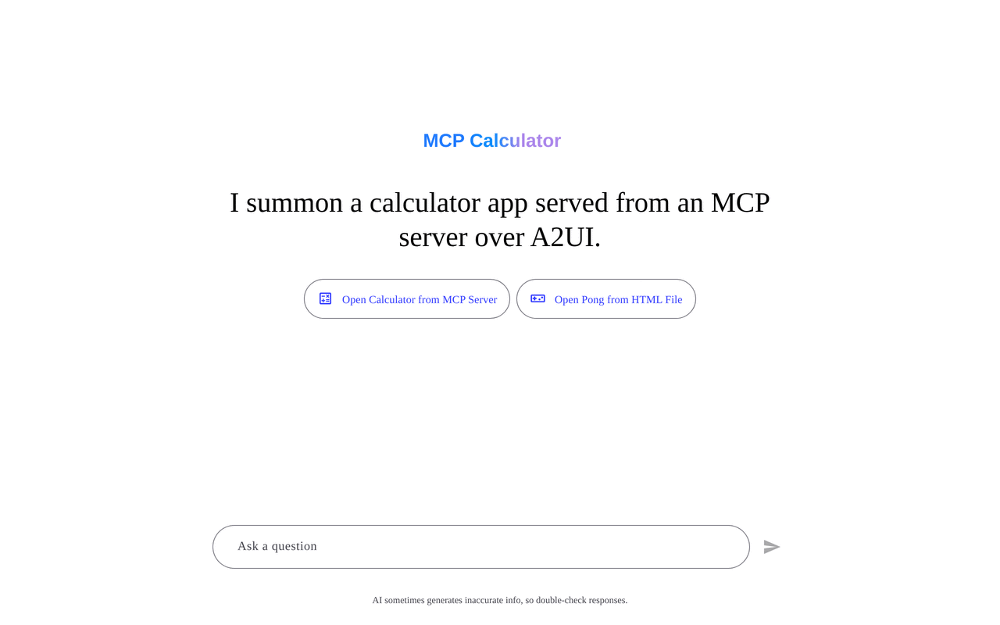
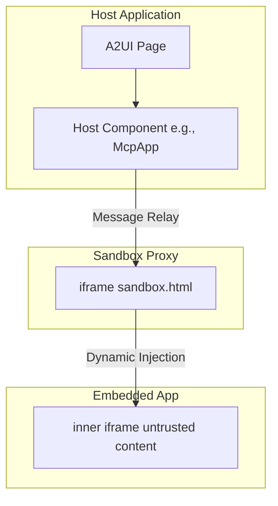
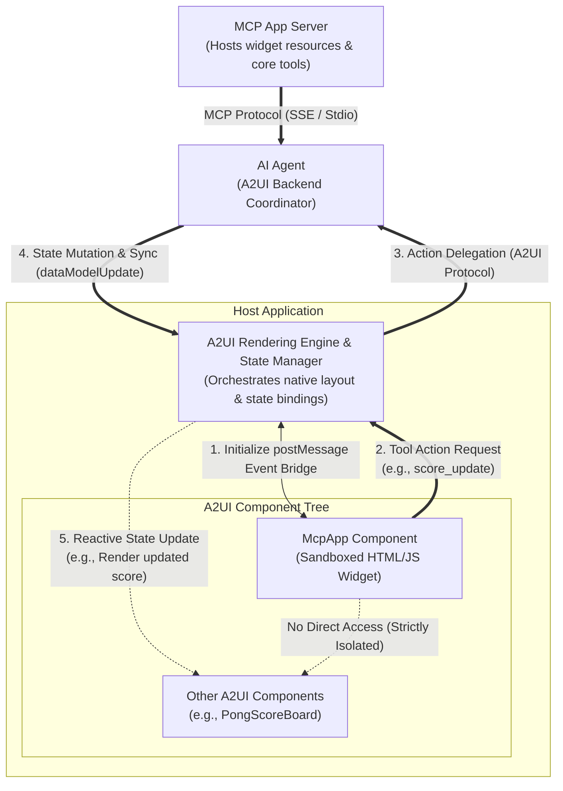

# 在 A2UI Surface 中集成 MCP Apps

本指南说明如何将 **Model Context Protocol (MCP) Applications** 集成并显示在 **A2UI** surface 中，同时介绍安全模型和测试指南。

> NOTE: 想了解核心 A2UI-over-MCP 协议？请参见 [A2UI over MCP](a2ui_over_mcp.md)，了解如何从 MCP tool call 返回 A2UI JSON payload。

## 概览

Model Context Protocol (MCP) 允许 MCP server 向 host 交付丰富、交互式、基于 HTML 的用户界面。A2UI 提供了一个安全环境来运行这些第三方应用。



## 双 iframe 隔离模式

为了安全运行不可信的第三方代码，A2UI 使用 **双 iframe** 隔离模式。这种方式在保持结构化 JSON-RPC 通道的同时，将原始 DOM 注入与主应用隔离开。

### 安全理由

标准单 iframe sandbox 如果把 `allow-scripts` 与 `allow-same-origin` 组合使用，通常会被绕过，从而破坏容器化。任何带有 `allow-scripts` 和 `allow-same-origin` 的 iframe 都可以通过编程方式与父 DOM 交互，或移除自身的 sandbox 属性来逃逸 sandbox。

为避免这种情况，A2UI 在运行第三方应用的内层 iframe 中严格排除 `allow-same-origin`。

### 架构

1.  **[Sandbox Proxy (`sandbox.html`)](https://github.com/a2ui-project/a2ui/blob/main/samples/client/shared/mcp_apps_inner_iframe/sandbox.html)**：从同源提供的中间 `iframe`。它在保持结构化 JSON-RPC 通道的同时，将原始 DOM 注入与主应用隔离。
    - 权限：不要在 host 模板中对它启用 sandbox（例如 [`mcp-app.ts`](https://github.com/a2ui-project/a2ui/blob/main/samples/community/client/lit/mcp-apps-in-a2ui-sample/mcp-app.ts) 或 [`mcp-apps-component.ts`](https://github.com/a2ui-project/a2ui/blob/main/samples/community/client/lit/mcp-apps-in-a2ui-sample/ui/custom-components/mcp-apps-component.ts)）。
    - Host origin 校验：校验消息来自预期的 host origin。
2.  **嵌入式应用（内层 iframe）**：最内层的 `iframe`。通过 `srcdoc` 动态注入，并使用受限权限。
    - 权限：`sandbox="allow-scripts allow-forms allow-popups allow-modals"`（**绝不能** 包含 `allow-same-origin`）。
    - 隔离：由于唯一 origin，移除对 `localStorage`、`sessionStorage`、`IndexedDB` 和 cookie 的访问。

### 物理 iframe 嵌套



### 端到端架构与生命周期流程

完整周期（包括布局树层级、完全分离的后端参与者 Proxy Agent 与 MCP Server，以及隔离的第三方 widget 如何与其原生 sibling（例如 Pong 游戏计分板）响应式交互）如下所示：



#### Sibling 更新循环如何工作：

1. **初始化 postMessage Event Bridge (1)**：Host shell 实例化双 iframe sandbox，并与 `McpApp` 组件建立安全的消息转发桥。
2. **工具动作请求 (2)**：当用户与 sandbox 中的 app 交互（例如在 Pong 游戏中得分）时，app 会通过 postMessage bridge 发送消息来触发 tool action。
3. **Action Delegation (3)**：Host layout engine 拦截该 action，并通过 A2UI/A2A 协议将执行委托给 `AI Proxy Agent`。如果需要外部计算或资源，agent 可选择使用标准 MCP Protocol（SSE / Stdio）与 `MCP App Server` 协调。
4. **状态变更与同步 (4)**：Agent 处理 action，修改主 session state，并将 `dataModelUpdate` 推回 host state manager。
5. **Reactive State Update (5)**：Host 更新本地 store，触发绑定到该 state path 的 sibling A2UI 组件（如原生计分板或显示组件）响应式更新。为了维持容器化安全，sandboxed component 与原生 sibling 元素之间的直接通信会被严格阻断。

## 使用方式 / 代码示例

MCP Apps 组件通常会解析为 A2UI catalog 中的 `custom` node。下面展示开发者可能如何在代码中使用它。

### 1. 在 Catalog 中注册

必须在你的 catalog 应用中注册该组件。例如，在 Angular 中：

```typescript
import {Catalog} from '@a2ui/web_core/v0_9';
import {z} from 'zod';
import {McpApp} from './mcp-app';
import {Button} from './button';
import {Snackbar} from './snackbar';

const McpAppSchema = z.object({
  content: z.union([z.string(), z.object({id: z.string()})]).optional(),
  allowedTools: z.array(z.string()).optional(),
  title: z.string().optional(),
});

export const DEMO_CATALOG = new Catalog(
  'my_app.org/some_catalog.json',
  [
    {name: 'McpApp', component: McpApp, schema: McpAppSchema},
    {
      name: 'Button',
      component: Button,
      schema: z.object({
        label: z.string(),
        action: z.any().optional(),
      }),
    },
    {
      name: 'Snackbar',
      component: Snackbar,
      schema: z.object({
        message: z.string(),
        durationMs: z.number().default(3000),
      }),
    },
  ]
);
```

### 2. 在 A2UI 消息中使用

在 Host 或 Agent 上下文中，发送一条会转换为该 custom node 的 A2UI 消息。

```json
{
  "type": "custom",
  "name": "McpApp",
  "properties": {
    "content": "<h1>Hello, World!</h1>",
    "title": "My MCP App"
  }
}
```

如果内容复杂或需要编码，可以传入 URL 编码字符串：

```json
{
  "type": "custom",
  "name": "McpApp",
  "properties": {
    "content": "url_encoded:%3Ch1%3EHello%2C%20World!%3C%2Fh1%3E",
    "title": "My MCP App"
  }
}
```

## 通信协议

Host 与嵌入的内层 iframe 之间通过 `postMessage` 上的结构化 JSON-RPC 通道通信。

- **Events**：Host Component 监听来自 proxy 的 `SANDBOX_PROXY_READY_METHOD` 消息。
- **Bridging**：`AppBridge` 负责消息转发。开发者（具体来说是不可信 iframe 内的 MCP App Developer）可以使用 `bridge.callTool()` 调用 MCP server 上的 tool。
- **The Host**：解析回调（例如具体 resize、Tool result）。

### 限制

由于最内层 iframe 严格省略了 `allow-same-origin`，适用以下条件：

- MCP app **不能** 使用 `localStorage`、`sessionStorage`、`IndexedDB` 或 cookie。每个应用都运行在唯一 origin 下。
- 父级无法直接操作 DOM。所有交互都必须通过消息传递进行。

## 前置条件

要运行示例，请确保已安装：

- **Python 3.10+** — agent 与 MCP server 后端所需
- **[uv](https://docs.astral.sh/uv/)** — 快速 Python 包管理器（用于运行所有 Python 示例）
- **Node.js 18+** 和 **Yarn** — 构建和运行此 monorepo workspace 中的示例客户端应用所需。
- **`GEMINI_API_KEY`** — 所有基于 ADK 的 agent 都需要。可从 [Google AI Studio](https://aistudio.google.com/apikey) 获取

> [!NOTE]
> **包管理器说明：** 在 A2UI 仓库内运行内置示例应用需要使用 Yarn，这是由 Corepack workspaces 配置决定的。如果是在本仓库之外做日常使用或独立项目，你可以选择自己喜欢的包管理器（例如 npm、pnpm）。

> ⚠️ **环境变量设置**：你可以在 shell 中 export `GEMINI_API_KEY`，也可以在每个 agent 目录中创建 `.env` 文件。Agent 会使用 `dotenv` 自动加载 `.env` 文件。
>
> ```bash
> # Option 1: Export in shell
> export GEMINI_API_KEY="your-api-key-here"
>
> # Option 2: Create .env file in the agent directory
> echo 'GEMINI_API_KEY=your-api-key-here' > .env
> ```

## 示例

有两个主要示例展示 MCP Apps 集成。每个示例都需要运行 **多个终端**：每个后端服务一个，客户端一个。

---

### 示例 1：MCP App Standalone Sample（Lit Client 与 ADK Agent）

此示例使用基于 Lit 的客户端和基于 ADK 的 A2A agent 来验证 sandbox。

#### 第 1 步：启动 Agent

在单独终端中进入 agent 目录并启动 agent：

```bash
cd samples/agent/adk/mcp-apps-in-a2ui-sample
uv run agent.py
```

Agent 会运行在 `http://localhost:8000`。

#### 第 2 步：启动客户端

在新终端中进入客户端目录并启动 dev server（需要先构建 Lit renderer）：

```bash
cd samples/client/lit/mcp-apps-in-a2ui-sample
yarn install
yarn dev
```

客户端启动在 `http://localhost:5173/`。

#### 第 3 步：在浏览器中打开

打开浏览器并访问 `http://localhost:5173/`。你应该会看到加载 MCP App 的 A2UI 界面。

**预期结果**：页面会在 sandboxed iframe 中加载 MCP App。点击 iframe 内的 “Call Agent Tool” 按钮会触发一个由 agent 处理的 action。

---

### 示例 2：MCP Apps（计算器 + Pong）（Angular 客户端 + MCP Server + Proxy Agent）

此示例使用基于 Angular 的客户端、MCP Proxy Agent 和远程 MCP Server 来验证 sandbox。它需要 **三个** 后端进程。

#### 第 1 步：启动 MCP Server（Calculator）

```bash
cd samples/community/mcp/mcp-apps-calculator/
uv run .
```

MCP server 使用 SSE transport 启动在 `http://localhost:8000`（如果 8000 端口被占用，会使用其他端口，例如 `uv run . --port 8001`）。

#### 第 2 步：启动 MCP Apps Proxy Agent

在 **新终端** 中：

```bash
cd samples/community/agent/adk/mcp_app_proxy/
export GEMINI_API_KEY="your-key"  # or use a .env file
uv run .
```

Proxy agent 默认启动在 `http://localhost:10006`。

#### 第 3 步：构建并启动 Angular 客户端

首先，在 **仓库根目录** 运行 `yarn build:all` 来构建 renderer package：

```bash
# Run at repository root
yarn build:all
```

然后，在 **新终端** 中进入客户端目录、安装本地依赖并启动应用（该命令会自动打包 sandbox iframe proxy 并启动开发服务器）：

```bash
# Navigate to the client directory
cd samples/community/client/angular/

# Install local dependencies
yarn install

# Start the app and bundle sandbox
yarn start mcp_calculator
```

> ⚠️ **必须运行 `yarn build:all`**：`yarn build:all` 会编译 Angular app 所依赖的 A2UI renderer package。运行 `yarn start mcp_calculator` 时会自动把 sandbox proxy 打包进 Angular 项目的 public assets，然后再启动开发服务器。

客户端启动在 `http://localhost:4200/`。

#### 第 4 步：在浏览器中打开

访问：

```
http://localhost:4200/?disable_security_self_test=true
```

**预期结果**：页面会渲染一组 smart chip，用于加载 calculator app 或 pong app。两个 app 都运行在各自的 sandboxed iframe 中。

|                                                 Calculator App                                                 |                                 Pong App                                  |
| :------------------------------------------------------------------------------------------------------------: | :-----------------------------------------------------------------------: |
|  |  |

---

## 测试用 URL 选项

出于测试目的，可以通过特定 URL 查询参数跳过安全自检。

### `disable_security_self_test=true`

该查询参数允许绕过验证 iframe 隔离的安全自检。对于双 iframe 设置可能无法通过严格 origin 检查的调试和测试环境（例如 `localhost` 开发），这很有用。

示例：

```
http://localhost:4200/?disable_security_self_test=true
```

## 故障排查

| Problem                                           | Solution                                                                                          |
| -------------------------------------------------- | --------------------------------------------------------------------------------------------------|
| `GEMINI_API_KEY environment variable not set`     | export 该 key，或在 agent 目录中添加 `.env` 文件                                                 |
| Python version error on `restaurant_finder` agent | 安装 Python 3.13+（该示例的 `pyproject.toml` 要求）                                             |
| `yarn build:renderer` fails                       | 确保已先在 `samples/client/lit/` 中运行 `yarn install`                                          |
| Angular client shows blank page                   | 确保在 `yarn start` 前运行了 `yarn build:sandbox`                                                |
| MCP app iframe doesn't load                       | 检查 MCP server（端口 8000）和 proxy agent（端口 10006）是否都在运行                            |
| `ng serve` not found                               | 运行 `yarn install` 安装包含 `@angular/cli` 在内的 dev dependencies                              |
| "URL with hostname not allowed"                   | Angular 21 会限制 allowed hosts。使用 `localhost`（默认值），不要传 `--host 0.0.0.0`             |
| Security self-test fails in dev                   | 在 URL 中添加 `?disable_security_self_test=true`                                                |
