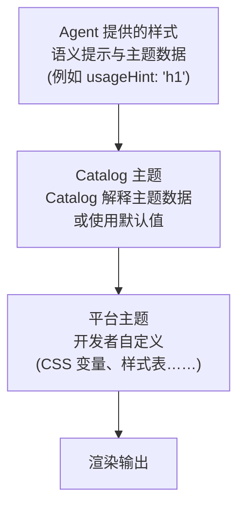

# 主题与样式

自定义 A2UI 组件的外观与风格，让它们匹配你的品牌。

## A2UI 的样式理念

A2UI 默认采用 **由渲染器控制样式** 的方式，但也可以通过 Catalog 灵活调整：

- **代理描述要显示什么**（组件与结构）
- **渲染器决定它看起来如何**（颜色、字体、间距）

不过，该协议足够灵活，在需要时也能让代理影响样式。

## 样式层次

A2UI 的样式按层次工作：



## Agent 提供的样式信息

### 语义提示

代理提供的是语义提示（而不是视觉样式），用来指导渲染。在 _basic catalog_ 中：

```json
{
  "id": "title",
  "component": {
    "Text": {
      "text": {"literalString": "Welcome"},
      "usageHint": "h1"
    }
  }
}
```

**常见的 `usageHint` 值：**

- Text：`h1`、`h2`、`h3`、`h4`、`h5`、`body`、`caption`
- 其他组件也有各自的提示值（参见 [组件参考](../reference/components.md)）

Catalog 元素会把这些语义提示映射为目标平台上真正的组件，并为其设置样式。

### `theme` 属性

A2UI 协议允许在 `createSurface` 消息中携带任意的 `theme` 属性。目前，该属性在 Zod schema 中被定义为
`z.any().optional()`，也就是说代理可以传递客户端渲染器和 Catalog 能够理解的任意 JSON 结构。

- 参见 [server-to-client.ts](../../../renderers/web_core/src/v0_9/schema/server-to-client.ts) 中的 schema 定义。
- 参见 [catalog/types.ts](../../../renderers/web_core/src/v0_9/catalog/types.ts) 中的 `Catalog` 类与 `themeSchema`。

**注意：** _basic catalog_ 的组件目前并未接入代理传来的 `theme`。

_想参与这项设计的讨论？欢迎在这里发表意见：[#1118](https://github.com/a2ui-project/a2ui/issues/1118)。_

## Catalog 主题

主题化是 Catalog 实现的职责。每个 Catalog 都可以提供自己想要的主题方案。举例来说，默认的 _basic catalog_ 是这样做的：

### Web Basic Catalog 主题

在 Web 上，默认 A2UI 渲染器所提供的 _basic catalog_ 是通过覆盖 CSS 变量来实现主题化的。

Basic catalog 组件会注入一个很小的样式表，为这些变量提供默认值。该样式表以 `:where(:root)` 为目标选择器，因此其
优先级（specificity）极低，宿主应用可以很轻松地覆盖它们。

例如，要覆盖主色，只需在你应用的 CSS 中添加：

```css
:root {
  --a2ui-color-primary: #ff5722;
}
```

参见 [default.ts](../../../renderers/web_core/src/v0_9/basic_catalog/styles/default.ts) 中的默认样式。

**查看各平台的示例：**

- [Lit samples](../../../samples/client/lit)
- [Angular samples](../../../samples/client/angular)
- [React samples](../../../samples/client/react)

### 逐组件覆盖

除了全局主题之外，_basic catalog_ 的每个组件还会暴露一些自定义变量，以进一步调整其外观。例如，`Card` 组件会暴露
一个 `--a2ui-card-background` 变量。

请查看各组件的文档，了解它分别暴露了哪些变量。

## 常见样式能力

### 深色模式

默认的 Web 渲染器支持根据系统偏好（`prefers-color-scheme`）自动切换深色模式。

如果想始终强制使用深色或浅色模式（或以编程方式控制切换），可以在生成内容的祖先元素上使用 `a2ui-light` 或
`a2ui-dark` 这两个 class 名。

### 自定义字体

字体的加载方式与其他 Web 应用相同。_basic catalog_ 的组件会尝试继承其容器的字体族，同时也提供两个可覆盖的变量：
`--a2ui-font-family-title` 和 `--a2ui-font-family-monospace`，可分别用于为标题和等宽文本块设置不同的字体。

## Flutter

Flutter 内置了主题支持。参见：

- Flutter 官方文档中的 [使用主题共享颜色和字体样式](https://docs.flutter.dev/cookbook/design/themes)。

## 最佳实践

### 1. 使用语义提示，不要使用视觉属性

代理应该提供语义提示（`usageHint`），而不是视觉样式：

```json
// ✅ 好的做法：语义提示
{
  "component": {
    "Text": {
      "text": {"literalString": "Welcome"},
      "usageHint": "h1"
    }
  }
}

// ❌ 不好的做法：视觉属性（不支持）
{
  "component": {
    "Text": {
      "text": {"literalString": "Welcome"},
      "fontSize": 24,
      "color": "#FF0000"
    }
  }
}
```

### 2. 保持可访问性

- 确保足够的颜色对比度（WCAG AA：普通文本 4.5:1，大号文本 3:1）
- 使用屏幕阅读器测试
- 支持键盘导航
- 在亮色和深色模式下都进行测试

### 3. 使用设计令牌

定义可复用的设计令牌（颜色、间距等），并在样式中统一引用，以保持一致性。

### 4. 跨平台测试

- 在所有目标平台上测试主题效果（Web、移动端、桌面端）
- 验证亮色和深色模式
- 检查不同屏幕尺寸和屏幕方向
- 确保跨平台的品牌体验一致

## 下一步

- **[定义你自己的 Catalog](defining-your-own-catalog.md)**：用你的样式构建自定义组件
- **[组件参考](../reference/components.md)**：查看所有组件的样式选项
- **[客户端接入](client-setup.md)**：在应用中设置渲染器
