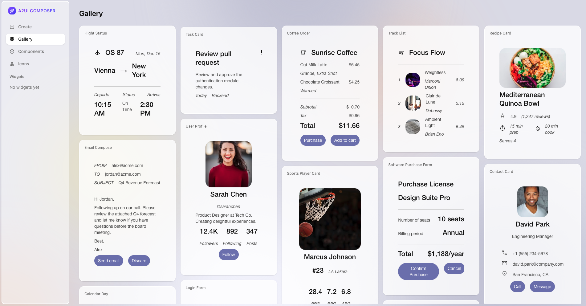

---
hide:
  - toc
---

<!-- markdownlint-disable MD041 -->
<!-- markdownlint-disable MD033 -->

<!-- Logo for Light Mode (shows dark logo on light background) -->

<!-- Logo for Dark Mode (shows light logo on dark background) -->

# 面向智能体驱动界面的协议

A2UI 让 AI 智能体能够生成丰富、可交互的用户界面，并在 Web、移动端和桌面端以原生方式渲染，而无需执行任意代码。

## 规范版本

| 版本 | 状态 | 说明 |
|---------|--------|-------------|
| **[v1.0](specification/v1.0-a2ui.md)** | **候选版** | 发布候选版本。新增客户端到服务端 RPC（`actionResponse`）、action ID，并将 theme 重命名为 surfaceProperties。（草案阶段曾称为 v0.10。）[查看演进指南 →](specification/v1.0-evolution-guide.md) |
| **[v0.9.1](specification/v0.9.1-a2ui.md)** | **当前版** | 当前可用于生产的版本。对 v0.9 做了少量优化，统一采用 `application/a2ui+json` MIME 类型，并放宽了 surfaceId 的约束。[查看演进指南 →](specification/v0.9.1-evolution-guide.md) |
| **[v0.9](specification/v0.9-a2ui.md)** | **稳定版** | 上一个稳定版本。理念上转向 Prompt-First。引入 `createSurface`、客户端函数、自定义 catalog、模块化 schema，以及 validation failed 错误格式。[查看演进指南 →](specification/v0.9-evolution-guide.md) |
| **[v0.8](specification/v0.8-a2ui.md)** | **旧版** | 旧版本。以 Structured Output 为先。包含基础的 surface、component、data binding 与 adjacency list 模型。 |

A2UI 采用 Apache 2.0 许可证，
由 Google 发起，[CopilotKit](https://docs.copilotkit.ai/generative-ui/a2ui) 与开源社区共同参与贡献，
并正在 [GitHub](https://github.com/a2ui-project/a2ui) 上持续活跃开发。

A2UI 要解决的问题是：**AI 智能体如何在跨越信任边界的情况下，安全地发送丰富的 UI？**

不同于只返回文本，或直接执行高风险代码，A2UI 让智能体发送**声明式组件描述**，再由客户端使用自己的原生控件进行渲染。这就像让智能体学会了一门通用的 UI 语言。

在这个仓库中，你会找到
[A2UI 规范](specification/v0.9.1-a2ui.md)（v0.9.1 当前版，v1.0 候选版），
客户端侧的 [渲染器](reference/renderers.md) 实现（Angular、Flutter、Lit、Markdown 等），
以及用于在智能体与客户端之间传递 A2UI 消息的 [传输层](concepts/transports.md)（如 A2A）。

- :material-shield-check: **从设计上保证安全**

    ---

    它是声明式数据格式，而不是可执行代码。智能体只能使用你在目录中预先批准的组件，从源头避免 UI 注入攻击。

- :material-rocket-launch: **对 LLM 友好**

    ---

    扁平、可流式传输的 JSON 结构，专为易生成而设计。LLM 不需要一次性生成完美 JSON，也可以增量构建 UI。

- :material-devices: **框架无关**

    ---

    一份智能体响应可在多端复用。你可以在 Angular、Flutter、React 或原生移动端中，用自己的样式组件渲染同一份 UI。

- :material-chart-timeline: **渐进式渲染**

    ---

    UI 更新生成后即可立即流式传输。用户无需等待完整响应，就能实时看到界面逐步构建出来。

## 5 分钟快速上手

- :material-clock-fast:{ .lg .middle } **[快速开始指南](quickstart.md)**

    ---

    运行餐厅查找示例，亲自体验由 Gemini 驱动的智能体如何使用 A2UI。

    [:octicons-arrow-right-24: 立即开始](quickstart.md)

- :material-react:{ .lg .middle } **[在任意 Agent 框架与 Harness 中使用 A2UI](guides/a2ui-with-any-agent-framework.md)**

    ---

    为你的 Agent 框架搭建一个 AG-UI 应用或 harness 脚手架，然后在客户端 surface 中启用 A2UI 渲染。

    [:octicons-arrow-right-24: 搭配任意智能体使用](guides/a2ui-with-any-agent-framework.md)

- :material-palette-outline:{ .lg .middle } **[A2UI Composer](https://a2ui-composer.ag-ui.com/)**

    ---

    通过可视化编辑器生成 A2UI JSON——无需安装。把生成结果粘贴到任意智能体提示词中即可使用。

    [:octicons-arrow-right-24: 打开 Composer](https://a2ui-composer.ag-ui.com/)

- :material-play-circle-outline:{ .lg .middle } **[A2UI Theater](https://a2ui-composer.ag-ui.com/theater)**

    ---

    在 Lit、React 和 Angular renderer 中逐步查看预置的 A2UI 流式场景。无需写代码，即可直观看到协议的运行过程。

    [:octicons-arrow-right-24: 打开演练场](https://a2ui-composer.ag-ui.com/theater)

- :material-book-open-variant:{ .lg .middle } **[核心概念](concepts/overview.md)**

    ---

    了解 surface、组件、数据绑定与邻接表模型。

    [:octicons-arrow-right-24: 学习概念](concepts/overview.md)

- :material-code-braces:{ .lg .middle } **[开发指南](guides/client-setup.md)**

    ---

    将 A2UI 渲染器集成到你的应用中，或者构建能够生成 UI 的智能体。

    [:octicons-arrow-right-24: 开始构建](guides/client-setup.md)

- :material-file-document:{ .lg .middle } **协议规范**

    ---

    深入阅读完整技术规范：[v0.8（旧版）](specification/v0.8-a2ui.md) · [v0.9（稳定版）](specification/v0.9-a2ui.md) · [v0.9.1（当前版）](specification/v0.9.1-a2ui.md) · [v1.0（候选版）](specification/v1.0-a2ui.md)

    [:octicons-arrow-right-24: 阅读 v0.9.1 规范](specification/v0.9.1-a2ui.md)

## 工作原理

1. **用户发送消息** 给 AI 智能体
2. **智能体生成 A2UI 消息**，描述 UI（结构 + 数据）
3. **消息被流式传输** 到客户端应用
4. **客户端使用原生组件渲染**（Angular、Flutter、React 等）
5. **用户与 UI 交互**，再把操作回传给智能体
6. **智能体响应**，并返回更新后的 A2UI 消息

## A2UI 实际效果

### 景观设计师示例

  

    <video width="100%" height="auto" controls playsinline style="display: block; aspect-ratio: 16/9; object-fit: cover;">
      <source src="assets/landscape-architect-demo.mp4" type="video/mp4">
      你的浏览器不支持 video 标签。
    </video>
  

  

    观看智能体为景观设计应用动态生成完整界面。用户上传照片后，智能体使用 Gemini 理解图像内容，并生成针对景观需求的定制表单。
  

### 自定义组件：交互式图表与地图

  

    <video width="100%" height="auto" controls playsinline style="display: block; aspect-ratio: 16/9; object-fit: cover;">
      <source src="assets/a2ui-custom-component.mp4" type="video/mp4">
      你的浏览器不支持 video 标签。
    </video>
  

  

    观看智能体如何在回答数值汇总问题时选择图表组件，在回答地理位置问题时选择 Google Map 组件。这两个组件都由客户端作为自定义组件提供。
  

### A2UI Composer

CopilotKit 也提供了一个公开可试用的 [A2UI Widget Builder](https://go.copilotkit.ai/A2UI-widget-builder)。

